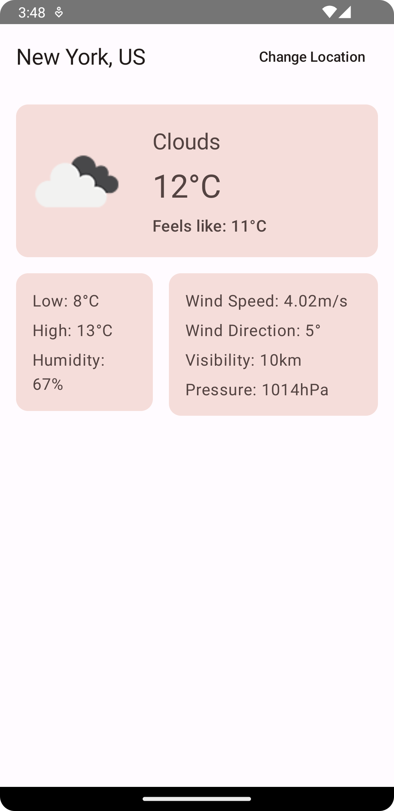
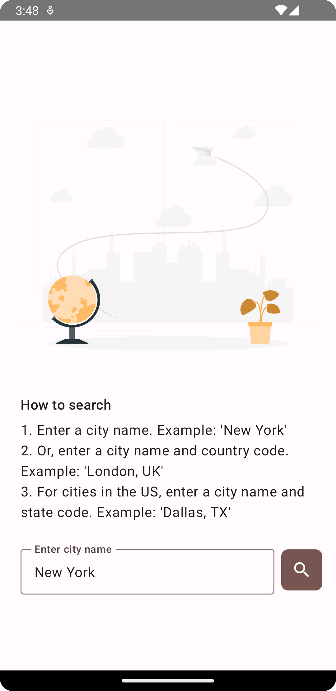
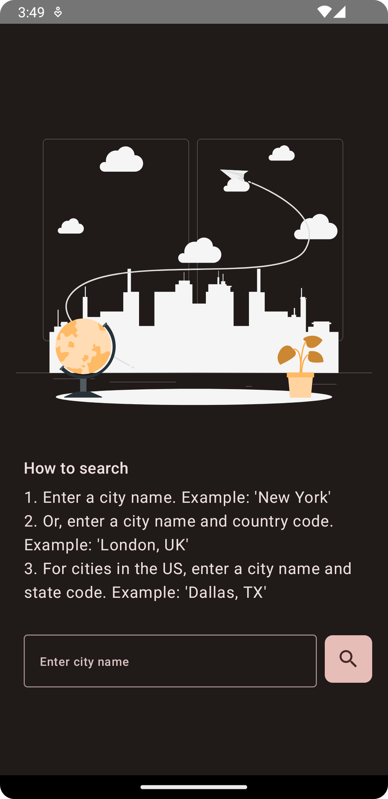
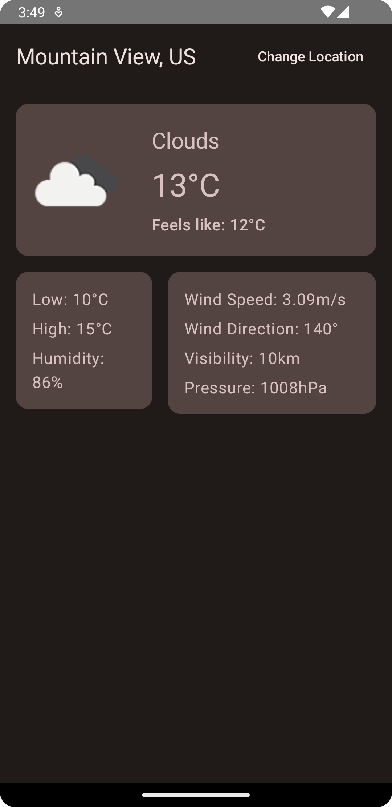
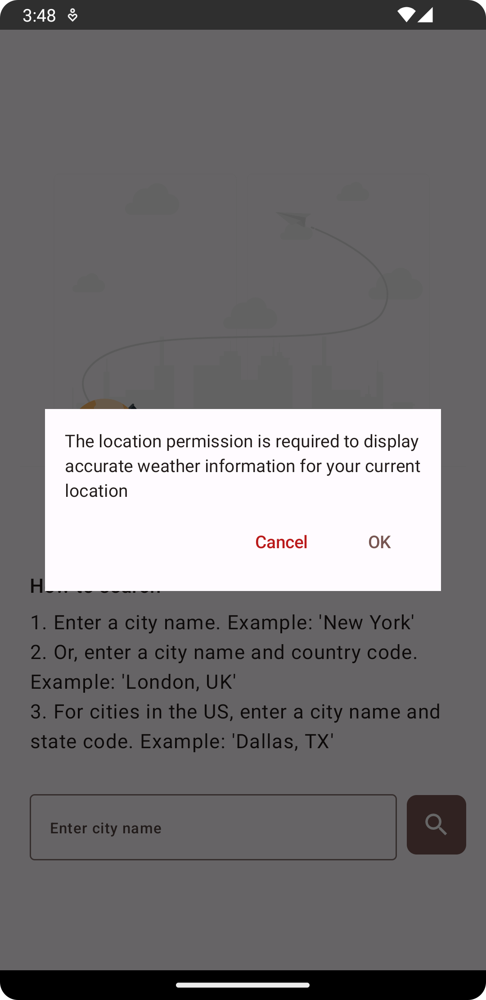

# Weather App

This is a simple weather app that uses the OpenWeatherMap API to get the weather data for a given
city.

The app is built using a modern MVVM architecture and uses the following libraries:

- [Retrofit](https://square.github.io/retrofit/) for networking
- [Moshi](https://github.com/square/moshi) for JSON parsing
- [Kotlin Coroutines](https://kotlinlang.org/docs/reference/coroutines-overview.html) for
  asynchronous programming
- [Hilt](https://developer.android.com/training/dependency-injection/hilt-android) for dependency
  injection
- [Jetpack Compose](https://developer.android.com/jetpack/compose) for building the UI
- [Jetpack Navigation](https://developer.android.com/guide/navigation) for navigating between
  screens
- [Coil](https://coil-kt.github.io/coil/) for image loading and caching
- [Accompanist](https://google.github.io/accompanist/) for Jetpack Compose-based persistence
  handling
- [MockK](https://mockk.io/) for mocking in tests

## Code Structure

The code is structured in the following packages:

- `data`: Contains the data layer of the app. It contains repositories and preferences.
- `di`: Contains the dependency injection modules.
- `network`: Contains the network layer of the app. It contains the Retrofit service and the API
  models.
- `ui`: Contains the UI layer of the app, including themes, screens, and view models.

## Screenshots

|  |  |  |
|:---:|:---:|:---:|
| Weather View | Search View | Permission Request |

|  |  |  |
|:---:|:---:|:---:|
| Search View (Dark Mode) | Weather View (Dark Mode) | Permission Rationale |

[Web illustrations by Storyset](https://storyset.com/web)